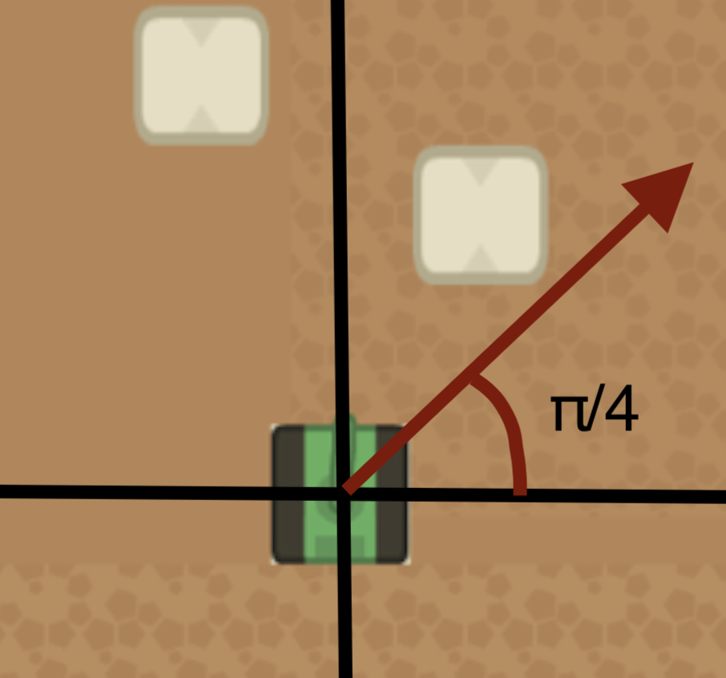

# Actions

The game consists of some actions that the players (tanks) can take at every turn. The action space for this game is quite simple, the players can shoot, move, or do both during their turn.

## Format

You will decide what action you'd like to take by printing a json object in the standard output. For example, if you wanted to shoot, you would do the following in python:

```python
import json

print(
    json.dumps(
        {"shoot": 3.14}
    )
)
```

## Shoot

The `shoot` action takes an angle in radians as its argument. This angle will determine the direction at which the tank will shoot.

For example, if you wanted to shoot in the "top-right" direction, you would post `{"shoot": 0.78}` to the standard output(0.78 ~= π/4).

Refer to the diagram below for more information on what the angle means visually.



To brush up on some math regarding angles, quadrants and radians, you can visit [here](https://www.ipracticemath.com/learn/trigonometry/quadrants-quadrantal-angles)

## Path

The `path` action takes a coordinate point on the map and the game server will actually figure out a route for your tank to get to your decided coordinate point. This action is convenient for those who want to travel to other points in the map without having to figure out the path themselves.

You only have to specify your destination coordinate point once. For example, you should NOT do the following:

- tick 1: `{"path": [100,100]}`
- tick 2: `{"path": [100,100]}`
- tick 3: `{"path": [100,100]}`

Instead, you can specify your target once and the server will remember where you want to go. You can also easily change your destination target if you decide to by calling the same action:

- tick 1: `{"path": [100,100]}`
- tick 2: `{}`
- tick 3: `{}`
- tick 4: `{"path": [250,300]}`

In the example above, the client initially chose to travel to the coordinate point `[100,100]`, then the client took no action for 2 ticks and in the 4th tick they decided to interrupt their previous journey, change their destination and go to `[250,300]`. This is a valid set of events.
