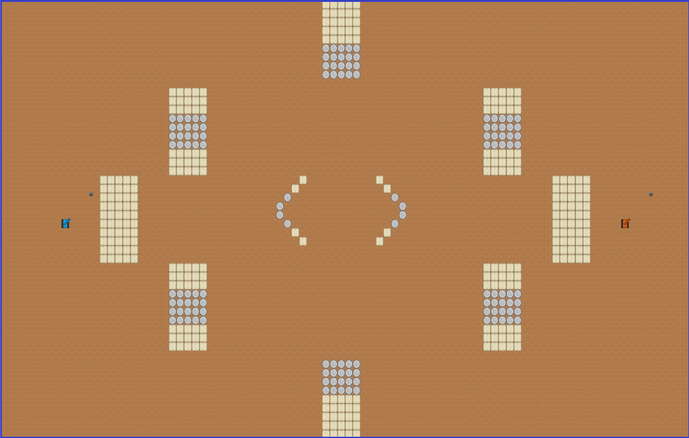
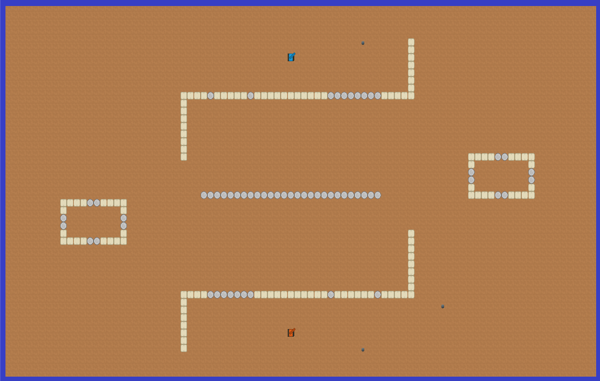
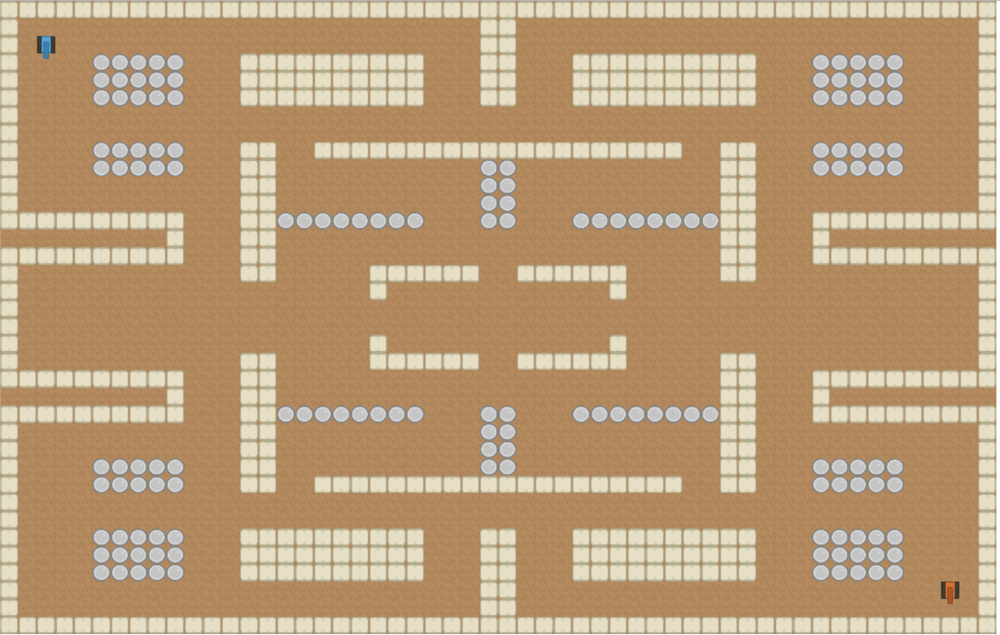
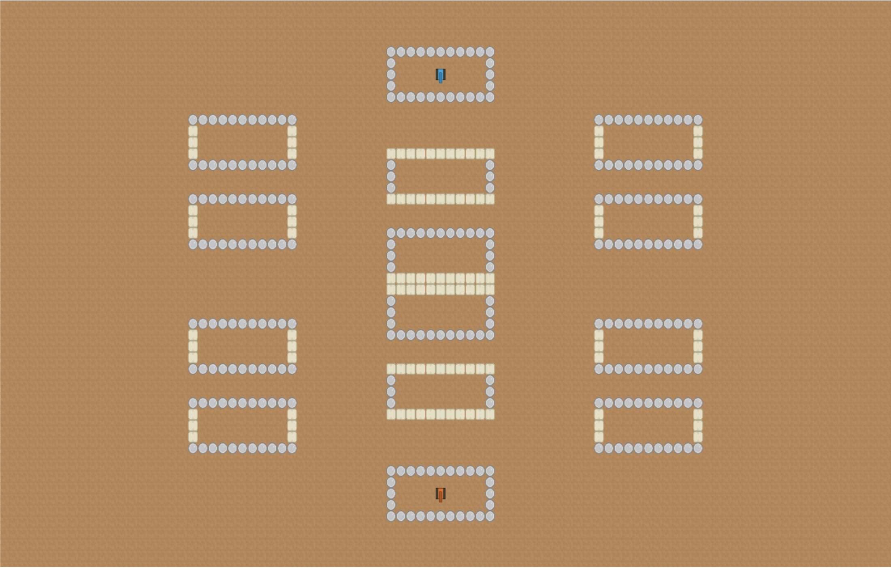
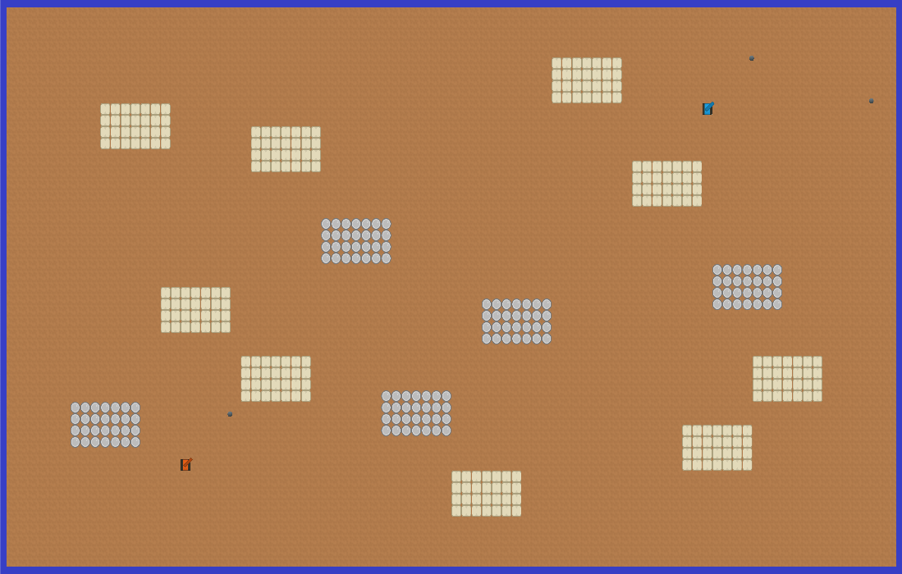
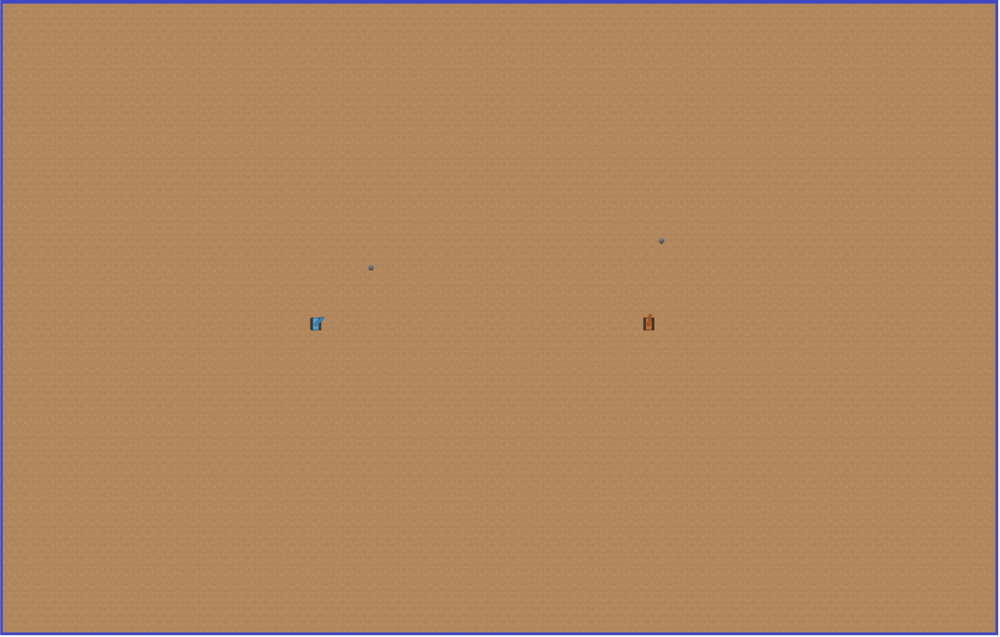

# Map

The game's map starts with the coordinate point `[0,0]` at its bottom left and its x and y coordinates increase as it
goes right and up respectively.

## Object Sizes

Different objects have different sizes on the map. You may need to use this information for some calculations.

- [**Walls**](../game_objects/wall.md) are 18x18 squares. The x,y position given for a wall shows the coordinates of its centre.
- [**Tanks**](../game_objects/tank.md) are 20x20 squares. The x,y position given for a tank shows the coordinates of its centre.
- [**Bullets**](../game_objects/bullet.md) are circles with a radius of 5. The x,y position given for a bullet shows the coordinates of its centre.
- [**Powerups**](../game_objects/powerup.md) are circles with a radius of 15. The x,y position given for a powerup shows the coordinates of its centre.

## Available Maps

### gulag.map

### theface.map

### pacman.map

### caged.map

### cluster.map

### empty.map

